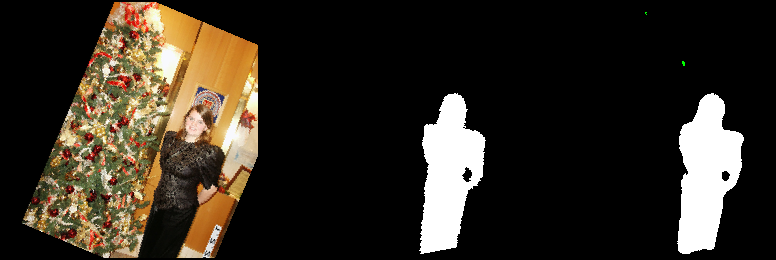
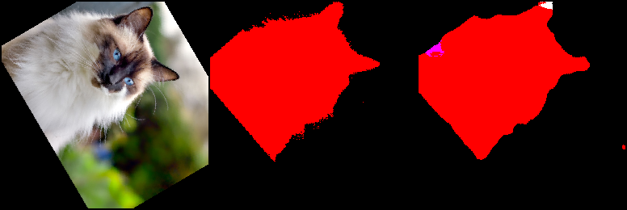

<div align="center">

# AI Learning

A project for AI learning


## Task 1: Using Unet to segment images (Pascal Voc 2012 dataset)
</div>

**1. Model training**
```Python
python train/image_segment/train.py
```

**2. Model evaluation**
```Python
python test/image_segment/test.py $model_path $input_image_dir
```

**3. some pictures during training**

source_image -> label_image -> model_output_image





